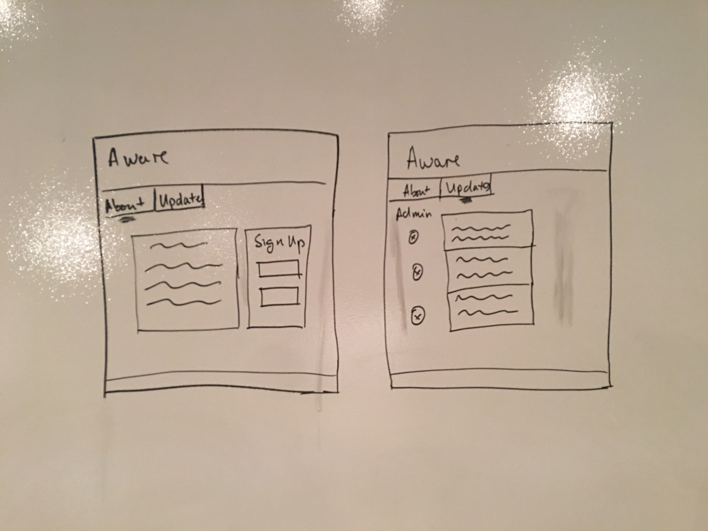
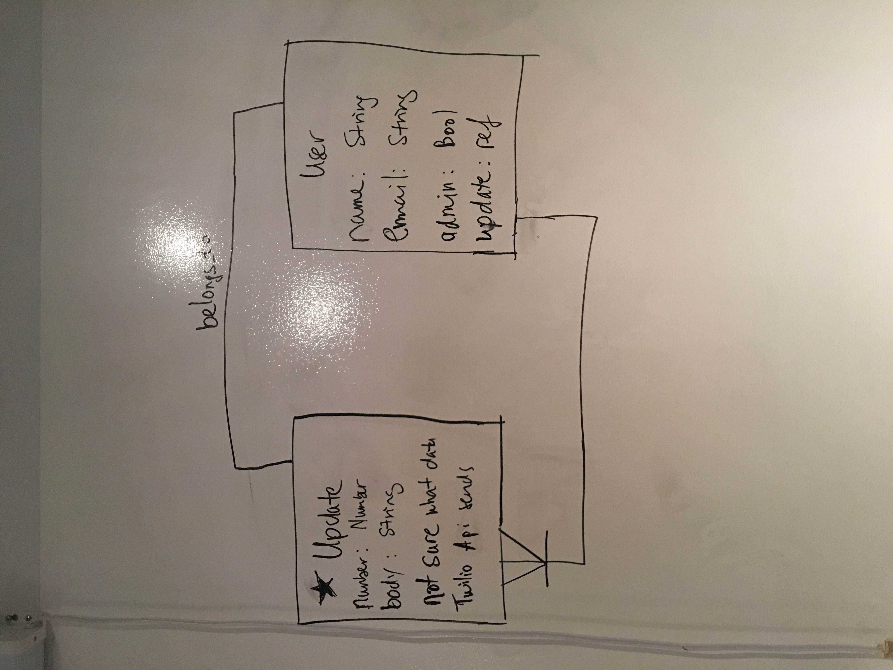

# Aware

Aware is an application that lets users be aware of all the important things happening. It will allow users to send updates via text and enable to visit the Aware homepage to see updates posted by themselves and other users in real time.

####Technologies Used
- Twilio Api
- MongoDB
- Express.js
- Angular.js
- Node.js

####Trello board: https://trello.com/b/dpBvGwF2/aware

